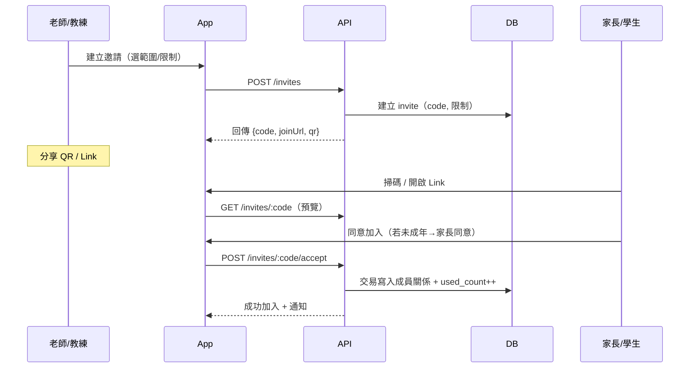
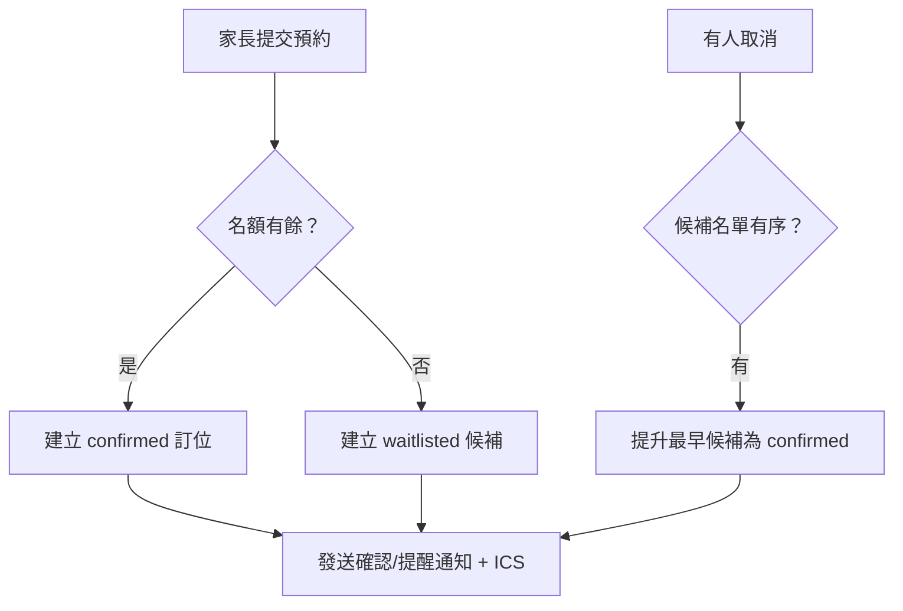

## PRD v1.0 — 教學/教練 App（MVP）

版本：1.0  
平台：iOS、Android（Flutter）  
後端：NestJS（TypeScript）、PostgreSQL、Redis、S3/GCS、BullMQ  
AI/OCR：OpenAI GPT-4o/4.1、Google Vision/AWS Textract、FastAPI（Python）  
主要角色：老師/教練、家長、學生、機構管理者

---

## 1. 目標與成功指標
- 產品目標
  - 以 AI 輔助改卷與評語，提高教師效率與一致性
  - 家長即時掌握孩子學習進度與課堂安排
  - 提供預約課堂與競賽報名，提高轉化與到課率
  - 成就展示牆強化學習動機與老師/教練專業形象
- MVP KPI（首三個月）
  - 老師周活 ≥ 35% ；AI 改卷採納率 ≥ 60%
  - 家長查看率 ≥ 65% ；預約轉化 ≥ 20% ；到課率 ≥ 85%
  - QR 入群轉化 ≥ 50% ；展示牆分享率 ≥ 10%

---

## 2. 範圍與不在範圍
- 在範圍（MVP）
  - 認證/角色、機構/班級與入群邀請（含 QR/深連結）
  - 作業/提交、AI 改卷與人審、成績發布、報告
  - 預約課堂（模板、Session、預約、候補/補位、簽到、提醒/ICS）
  - 競賽（賽事/分組、報名/候補、簽到、基本成績發布）
  - 成就/徽章與展示牆、排行榜（班級/機構/賽事）
  - 精簡社群貼文（圖文/短片、按讚/留言、檢舉）
  - 支付/點數（Stripe 訂閱、IAP/Play 點數）
  - 隱私/合規與商店政策（兒少保護、刪除帳號、家長閘）
- 不在範圍（未來）
  - 即時影音互動教學、白板/課中工具
  - 進階報表自訂、BI 連接器
  - 進階搜尋（全文/向量）與推薦
  - 完整 B2B 機構後台（配額/發票/對賬深度）

---

## 3. 人物誌（Personas）與角色權限
- 老師/教練：建班、出題、AI 改卷審核、排程/預約、賽事、授勳、貼文
- 家長：綁定孩子、查看報告/成績、預約/候補/改期/取消、隱私同意、展示牆管理
- 學生：提交作業、查看成績/回饋、展示牆（依年齡/家長設定）
- 機構管理者：課程/老師配置、對賬、統計、內容審核

權限概要（精選）：
- `teacher|coach`：CRUD 班級/作業/排程/賽事；確認 AI 成績；授勳；貼文管理
- `parent`：綁定/同意；替子女預約與管理；展示牆可見性控制
- `student`：提交作業、查看回饋；個人展示牆受保護
- `admin`：審核/封鎖；設定模板與徽章；匯出報表

---

## 4. 核心用例與流程

### 4.1 QR 入群邀請
- 老師為班級/機構/賽事項目建立邀請：限制到期/次數/角色 → 產生深連結與 QR → 分享
- 家長/學生掃碼 → App/落地頁預覽 → 同意加入（未成年需家長同意）→ 建立成員關係

流程圖（Mermaid）：


### 4.2 預約課堂（候補/補位/提醒）
- 教練設定可預約模板 → 批量生成未來 8–12 週 Session → 家長搜尋/預約 → 滿額進候補 → 有人取消自動補位 → 提醒/簽到

流程（候補與補位）：


### 4.3 競賽（賽事/分組/簽到/成績）
- 教練建立賽事與分組限制（年齡/性別/量級） → 報名/候補 → 現場簽到 → 成績發布 → 生成成績卡片/展示牆

### 4.4 作業/AI 改卷/發布
- 老師出題+Rubric → 學生提交（拍照/PDF）→ OCR/抽取 → LLM 評分+評語草稿 → 老師審核/覆寫 → 發布成績 → 通知/報表

### 4.5 成就與展示牆
- 事件（成績/到課/比賽）→ 規則引擎判斷 → 頒發徽章 → 自動/手動加入展示牆（家長可見性控制）

---

## 5. 詳細功能需求與驗收標準（AC）

### 5.1 認證/帳戶/同意
- Email/手機註冊（OTP 可後續）、登入、找回密碼；基本檔案（名稱、頭像、時區）
- 兒少：家長綁定與同意；同意可撤回；刪除/匯出資料入口
- AC：
  - 新註冊預設角色為 `parent`；可透過邀請新增 `teacher|coach|student`
  - 刪除帳號 7 天冷卻期，可恢復；逾期不可逆

### 5.2 組織/班級/入群（含 QR）
- 建立 `Organization` / `ClassRoom`、導入名單、產生邀請碼/QR、限制（到期/最大次數/角色）
- 深連結：`https://join.yourapp.com/i/{code}`（Universal/App Links；安裝後回跳）
- 安全：可撤銷；使用數與審計；容量/資格檢查在交易內完成
- AC：
  - 200 併發掃碼下，僅容量內成功，其餘回應滿額/候補；無重覆加入
  - 撤銷立即生效；審計可查

### 5.3 作業/提交/AI 改卷
- 作業：標題/說明/截止、Rubric（criteria/levels/weights）
- 提交：相機掃描、多頁、去陰影/裁切；支援 PDF 圖片
- AI：OCR→結構化→Rubric 比對→分數與評語草稿；信心低需人審
- 老師審核：覆寫/編輯，版本留存；發布後通知家長
- AC：
  - 清晰樣張 OCR 準確率 ≥ 95%；低信心不可直發
  - 成績發布 2s 內發出通知；報告即時更新

### 5.4 報告/視覺化
- 學生趨勢（平均/分項/進步）、班級分布、PDF 匯出
- AC：
  - 支援期間（近30/90天、自訂）；導出在 30 秒內完成或給排程下載連結

### 5.5 通知/提醒/行事曆
- 即時通知：提交、評分完成、預約狀態（確認/候補/補位/取消）
- 提醒：T-24h / T-1h；ICS 訂閱（tokenized URL）
- AC：
  - 通知 P95 ≤ 5 秒；ICS 變更 1 分鐘內同步

### 5.6 預約/候補/補位/簽到
- 模板：週期/日期範圍、資源/地點、容量、價格、政策（取消/改期）
- Session：批量生成、開關報名、可見性（公開/私密）
- 預約：容量檢查在交易中；幂等 key；超賣=0
- 候補：FIFO；取消觸發自動補位（可通知付款）
- 簽到：現場/代簽；狀態=出席/缺席；名單匯出
- AC：
  - 併發 200 下超賣=0；候補轉正≤5 秒內通知
  - 政策限制顯示明確（剩餘分/時）並阻擋不符操作

### 5.7 競賽/分組/成績
- 分組限制（年齡/性別/量級）；名額/候補；簽到與成績發布
- AC：
  - 不符條件報名被拒並提示；簽到名單與報名一致

### 5.8 成就/展示牆/排行榜
- 徽章：系統/機構定義、圖示、點數、條件（JSON）
- 展示牆：成績卡、比賽結果、徽章、作品/證書；可見性=私密/機構/公開
- 排行榜：班級/機構/賽事，指標=平均分/進步/出席
- AC：
  - 事件觸發 10 秒內授勳；同一徽章去重；家長撤回同意後 60 秒內全站下架

### 5.9 社群貼文（精簡）
- 圖文/短片、按讚/留言、檢舉；未成年公開需家長同意
- AC：
  - 檢舉自動進審核佇列；違規自動下架 + 人工覆核

### 5.10 支付/點數/退款
- 教師端訂閱（Stripe）；家長端課堂：免費/線下/點數兌換；線上即時課建議 IAP/Play 或點數
- 對賬：日匯總；訂單狀態與預約同步
- AC：
  - 付款成功=confirmed；失敗=保留候補或取消；對賬誤差=0

---

## 6. 系統設計與資料模型

### 6.1 主要資料表（核心欄位摘要）
- `User(id, email/phone, password_hash/social_id, locale, roles[])`
- `Organization(id, name, type)`
- `ClassRoom(id, org_id, name, subject, coach_id)`
- `StudentProfile(id, user_id?, external_ref, org_id)`
- `ParentLink(id, parent_user_id, student_id, consent_status, consent_at)`
- `Assignment(id, class_id, title, rubric_id, due_at, status)`
- `Rubric(id, name, criteria[])`
- `Submission(id, assignment_id, student_id, media_ids[], text, submitted_at, status)`
- `AIJob(id, submission_id, stage, provider, cost_tokens, result, status, started_at, finished_at)`
- `Grade(id, submission_id, total_score, per_criterion[], teacher_note, published_at, version)`
- `ReportSnapshot(id, target_id, target_type, period, metrics_json, generated_at)`
- `Notification(id, user_id, type, payload, read_at)`
- 預約/排課：`Resource`, `AvailabilityTemplate`, `BlackoutWindow`, `Session(id, org_id, coach_user_id, resource_id, time_range tsrange, capacity, price_cents, status, visibility)`, `BookingPolicy`, `Booking(id, session_id, student_id, status, payment_intent_id?, check_in_at?)`, `WaitlistEntry`, `Attendance`
- 競賽：`Competition`, `CompetitionDivision`, `CompetitionRegistration`
- 展示：`AchievementDefinition`, `UserAchievement`, `PortfolioItem`
- 金流：`Subscription`, `CreditLedger`

### 6.2 關鍵約束與索引（示例）
```sql
CREATE EXTENSION IF NOT EXISTS btree_gist;

-- Session 時段不重疊（每資源）
ALTER TABLE session
ADD CONSTRAINT session_no_overlap_per_resource
EXCLUDE USING gist (
  resource_id WITH =,
  time_range WITH &&
) WHERE (status IN ('open','closed'));

-- 邀請碼
CREATE TYPE invite_target AS ENUM ('org','class','competition','group');
CREATE TYPE invite_status AS ENUM ('active','revoked','expired');

CREATE TABLE invite (
  id UUID PRIMARY KEY DEFAULT gen_random_uuid(),
  code TEXT UNIQUE NOT NULL,
  target_type invite_target NOT NULL,
  target_id UUID NOT NULL,
  role_to_assign TEXT CHECK (role_to_assign IN ('parent','student','teacher','coach')) NOT NULL,
  created_by UUID NOT NULL,
  max_uses INT NOT NULL DEFAULT 1,
  used_count INT NOT NULL DEFAULT 0,
  expires_at TIMESTAMPTZ,
  status invite_status NOT NULL DEFAULT 'active',
  metadata JSONB DEFAULT '{}'::jsonb,
  created_at TIMESTAMPTZ NOT NULL DEFAULT now(),
  revoked_at TIMESTAMPTZ
);

CREATE INDEX idx_invite_active ON invite (code) WHERE status='active';
```

### 6.3 事件流與佇列
- 事件主題：`grade.published`, `booking.confirmed`, `booking.waitlisted`, `booking.promoted`, `competition.result_published`, `attendance.checked_in`, `invite.accepted`
- 消費者：授勳/展示牆更新、提醒與通知、報表快照、補位處理

---

## 7. API 契約（精選 + 示例）

### 7.1 邀請（QR/深連結）
- POST `/invites`
```json
{
  "targetType": "class",
  "targetId": "uuid-class",
  "roleToAssign": "parent",
  "maxUses": 20,
  "expiresAt": "2025-12-31T00:00:00Z"
}
```
回應：
```json
{
  "id": "uuid-invite",
  "code": "Ab12CdE9Fg",
  "joinUrl": "https://join.yourapp.com/i/Ab12CdE9Fg",
  "qrPngUrl": "https://cdn.../qr/Ab12CdE9Fg.png",
  "status": "active"
}
```
- GET `/invites/:code` → 預覽（名稱、類型、剩餘名額、到期）
- POST `/invites/:code/accept`
```json
{ "studentId": "uuid-student", "idempotencyKey": "abc-123" }
```
錯誤碼：`INVITE_EXPIRED`, `INVITE_REVOKED`, `INVITE_CAP_REACHED`, `ALREADY_MEMBER`

### 7.2 預約
- POST `/availability-templates`（建立週期可預約模板）
- POST `/sessions`（由模板生成或手動建立）
- GET `/calendar/search?from=...&to=...&subject=...&near=...`
- POST `/bookings`
```json
{
  "sessionId": "uuid-session",
  "studentId": "uuid-student",
  "paymentMethod": "credit|offline|iap|stripe",
  "idempotencyKey": "book-123"
}
```
回應（成功）：
```json
{ "id": "uuid-booking", "status": "confirmed" }
```
錯誤碼：`SESSION_FULL`, `SESSION_CLOSED`, `POLICY_VIOLATION`, `DUPLICATE_REQUEST`

- PATCH `/bookings/:id/cancel` | `/reschedule`
- POST `/bookings/:id/check-in`

### 7.3 比賽
- POST `/competitions` | `/competitions/:id/divisions`
- POST `/competitions/:id/register`
```json
{ "divisionId": "uuid-division", "studentId": "uuid-student", "idempotencyKey": "reg-1" }
```
錯誤碼：`DIVISION_FULL`, `ELIGIBILITY_FAILED`

### 7.4 AI/評分
- POST `/ai/jobs` { submissionId } → 202
- GET `/ai/jobs/:id` → 狀態/結果；POST `/grades/:submissionId/confirm`

### 7.5 展示牆/徽章
- GET `/profiles/:userId/wall` → { stats, grades, competitions, achievements, portfolio }
- POST `/achievements/award` | POST `/portfolio`

備註：
- 分頁：`page`/`pageSize`（預設 20，上限 100）
- 時間：皆用 UTC ISO8601；客戶端依時區顯示
- 幂等：所有「建立/支付/預約」類 API 必須支援 `Idempotency-Key`

---

## 8. 深連結與 QR 產生規範
- URL：`https://join.yourapp.com/i/{code}`；`code` 為 base62（長度 10–16）
- App/Universal Links 設定：iOS `apple-app-site-association`、Android `assetlinks.json`
- QR：PNG 512x512，誤碼等級=H，內嵌 15% 留白與品牌標誌（不遮關鍵定位點）
- 安裝後回跳：使用 `install_referrer` 或首次啟動深連結參數
- 風控：每 IP 速率限制、裝置指紋、黑名單；錯誤提示友善且不洩漏存在性

---

## 9. 非功能性需求（NFR）與 SLO
- 可用性：月 ≥ 99.9%；RPO ≤ 24h；RTO ≤ 4h
- 延遲：讀取 P95 ≤ 300ms；寫入/交易 P95 ≤ 600ms；通知送達 P95 ≤ 5s
- 擴展：支援 10 萬月活、同時 5k 線上；任務佇列峰值 100 TPS
- 一致性：預約/候補/補位全流程使用交易鎖 + SKIP LOCKED + 幂等 key
- 安全：TLS1.2+、AES-256、KMS、最小權限、WAF、審計日誌
- 隱私：GDPR/PDPA；兒少/家長同意；資料區域化（APAC：新加坡/東京）
- 本地化：i18n（中/英），數字/日期/時區；RTL 後續
- 無障礙：支援螢幕閱讀與對比度；動作/顏色不作唯一訊息承載
- 行動裝置：iOS 15+、Android 8+；啟動 ≤ 2.5s、裝置離線可提交暫存（重試）

---

## 10. 安全、合規與商店政策
- 兒少：家長綁定、可撤回公開、未成年預設私密；家長閘（外部連結）
- 帳號刪除：App 內入口；7 天冷卻與提醒；資料匯出（JSON/ZIP）
- 內容審核：自動 + 人工；UGC 舉報→下架→覆核；稽核記錄完整
- 商店：IAP/Play Billing 合規、隱私政策、資料蒐集聲明、崩潰率/效能要求

---

## 11. 觀測與營運
- 監控：SLO 儀表板（請求延遲/錯誤率/任務失敗率/佇列長度）
- 錯誤追蹤：Sentry（前/後端）；崩潰率 ≤ 1%
- 日誌：結構化 JSON；關鍵路徑（預約/支付/授勳）全鏈路 Trace
- 警報：P1（停機/支付失敗率>2%）、P2（預約超賣>0）
- Runbook：補位重試、支付對賬、資料修復、撤銷誤頒徽章

---

## 12. 發布計畫與里程碑（12 週）
- 週1–2：QR 邀請與深連結、App 掃碼/預覽/接受、撤銷；排程模板與 Session 生成
- 週3–4：預約/候補/補位、提醒與 ICS、簽到；報告 v1；展示牆/授勳基礎
- 週5–6：競賽 MVP（賽事/分組/報名/簽到/成績）；排行榜
- 週7–8：支付/點數（Stripe/IAP/Play）、對賬、退款規則；風控與壓測
- 週9–10：AI 改卷打磨（提示/信心/人審 UX）；PDF 導出；社群精簡版
- 週11–12：合規稽核、Beta 試點、崩潰與效能優化、商店上架

---

## 13. 驗收測試（Gherkin 精選）

### QR 入群
```
Given 老師為班級生成到期 7 天、最大 20 次的邀請
When 30 位家長在 10 秒內同時掃碼接受
Then 僅 20 位成功加入，10 位顯示「名額已滿」且無重覆加入紀錄
```

### 預約與候補
```
Given 課堂容量 10，已滿且有 3 位候補
When 1 位已確認取消
Then 候補序第一位在 5 秒內被提升為確認，並收到通知與 ICS 更新
```

### 改期/取消政策
```
Given 政策 cancel_before_mins=120
When 家長在課前 90 分鐘取消
Then 顯示政策限制且取消失敗；在課前 3 小時取消則成功
```

### 比賽報名驗證
```
Given 分組年齡限制 10–12
When 9 歲學生嘗試報名
Then 報名失敗並提示年齡不符
```

### 成就與展示牆
```
Given 學生連續 4 次按時提交
When 最新一次成績發布
Then 系統頒發「連續提交 4 次」徽章並自動加入展示牆（預設私密）
```

### AI 改卷人審
```
Given AI 低信心（< 阈值）
When 老師未審核直接發布
Then 系統阻擋並提示需人審；審核後方可發布
```

---

## 14. 事件與分析（追蹤方案）
- `invite_created`, `invite_previewed`, `invite_accepted` {targetType, role, success, reason}
- `session_published`, `booking_attempted`, `booking_confirmed`, `waitlisted`, `promoted`, `cancelled`, `rescheduled`
- `competition_created`, `division_registered`, `check_in`, `result_published`
- `grade_published`, `ai_suggest_generated`, `ai_accepted`
- `achievement_awarded`{key}, `portfolio_item_added`, `privacy_changed`
- `notification_sent`{type}, `opened`
- 公共欄位：userId, orgId, classId, sessionId, device, appVersion, locale, tz, ts

---

## 15. 錯誤碼與回覆規範（摘要）
- 4xx：參數/權限/資源狀態
  - `INVITE_EXPIRED`(410), `INVITE_REVOKED`(403), `INVITE_CAP_REACHED`(409), `ALREADY_MEMBER`(409)
  - `SESSION_FULL`(409), `SESSION_CLOSED`(403), `POLICY_VIOLATION`(422), `DUPLICATE_REQUEST`(409)
  - `DIVISION_FULL`(409), `ELIGIBILITY_FAILED`(422)
- 5xx：服務暫時性錯誤；回傳 `retryAfter`（秒）
- 回應格式：
```json
{ "error": { "code": "SESSION_FULL", "message": "Session is full", "details": {"remaining": 0} } }
```

---

## 16. 風險與緩解
- AI 準確度不足 → Rubric 顯式化、信心閾值、人審預設、錯誤分析迭代
- 兒少內容公開風險 → 家長同意/撤回、預設私密、審核與稽核
- 預約超賣/重入 → 交易鎖、幂等、EXCLUDE 約束、壓測
- 成本暴衝 → AI/ OCR 配額、批次/壓縮、模型選擇與蒸餾

---

## 17. 詞彙（Glossary）
- Session：可預約的單次課堂時段
- Waitlist：滿額後候補序列，取消時自動補位
- Portfolio：展示牆的單個條目，來源於成績/比賽/徽章/作品
- Visibility：私密/機構/公開的可見性層級

---

## 18. Go/No-Go 驗收清單
- QR 入群：生成/預覽/接受/撤銷全通；併發一致性通過
- 預約：模板→Session→預約/候補/補位→提醒→簽到完整
- 競賽：賽事→分組→報名→簽到→成績→展示牆完整
- AI 改卷：端到端、人審強制、報告/通知正常
- 支付：扣點/Stripe/IAP/Play 流程與對賬一致
- 合規：刪除帳號、家長閘、隱私政策、資料區域化到位