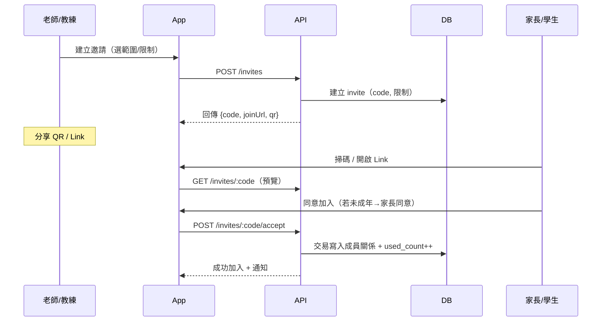
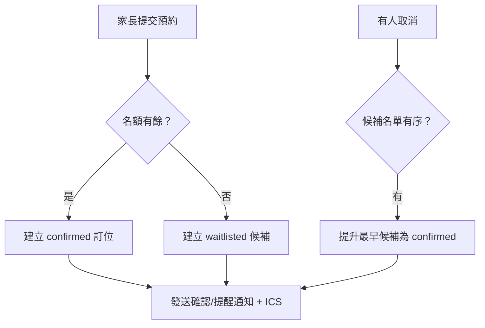
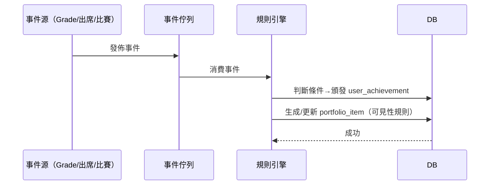

## PRD v1.0 — 教學/教練 App（含預約/比賽、QR 入群、成就展示牆）

版本：1.0  
範圍：iOS、Android（Flutter）；後端 NestJS + Postgres；AI 服務（OCR/LLM）  
角色：老師/教練、家長、學生、機構管理者

---

## 產品目標與成功指標
- 目標
  - AI 輔助改卷/評語節省老師時間
  - 家長即時掌握學習與課堂安排
  - 教練建立品牌影響力（社群 + 展示牆）
  - 可預約課堂與比賽報名，提高轉化與出席率
- KPI（MVP）
  - 老師周活≥35%，AI 改卷採納率≥60%，家長查看率≥65%
  - 預約轉化率≥20%，到課率≥85%，候補轉正≥15%
  - QR 入群轉化≥50%，展示牆分享率≥10%

---

## 角色與權限
- 老師/教練：建立/管理班級、作業/AI 改卷、課堂排程、預約、比賽、授勳、發布貼文
- 家長：綁定孩子、查看成績/報告、預約/候補、隱私同意、展示牆管理（未成年）
- 學生：提交作業、查看成績/回饋、展示牆（視年齡與家長設定）
- 機構管理者：課程/老師配置、對賬、統計、審核

---

## 用例（User Stories）與流程圖

### A. QR 入群邀請
- 作為老師，我可以為班級/機構/賽事項目產生可分享的邀請碼與 QR，設置到期/次數/角色，讓家長或學生掃碼快速加入。
- 作為家長/學生，我可以掃碼，預覽群組資訊並同意加入（未成年需家長同意）。
- 作為管理者，我可以撤銷或暫停邀請碼，避免濫用。

流程（序列）：


### B. 預約課堂（含候補/補位）
- 作為教練，我可設定可預約時段（單次/週期）、價格/人數/地點/政策，系統自動生成 Session。
- 作為家長，我可搜尋與預約、進候補、收到提醒，並在政策允許下改期/取消。
- 作為教練，我可查看候補名單並手動/自動補位、簽到出席。

流程（候補與補位）：


### C. 比賽（賽事/分組/簽到/成績）
- 作為教練，我可建立賽事、設定分組/名額與規則、開放報名與候補、現場簽到、發佈成績。
- 作為家長/學生，我可在規則允許下報名分組、收到簽到與賽程提醒、查看成績卡片。

### D. 成就展示牆（成績/徽章/作品）
- 作為學生/家長，我可在成績發布或比賽結束後，將成績卡片加入展示牆，並設定可見性。
- 作為系統/教練，當符合規則時自動頒發徽章（連續提交/進步幅度/到課率）。
- 作為家長，我可對未成年子女的展示牆公開行為進行同意/撤回。

事件 → 授勳 → 展示牆：


---

## 功能需求與驗收標準（AC）

### 1) 認證與角色/機構
- 支援 Email/手機註冊、第三方登入（可後續）
- 角色：teacher/coach/parent/student/admin；可多角色
- AC
  - 新註冊預設角色=家長（可由邀請碼切換/新增）
  - 班級/機構/賽事的角色授權由邀請流程或管理者指派
  - GDPR/兒少：刪除帳號自助入口；資料匯出

### 2) 作業/提交/AI 改卷
- 老師出題與 Rubric；學生拍照/上傳；AI 產生分數與評語草稿→老師審核→發布
- AC
  - 圖片多頁、OCR 成功率≥95%（清晰度標準範例）
  - 老師可覆寫分數與評語；保留審核版本
  - AI 低信心自動標記需人審；不可直發

### 3) 報告與通知
- 學生/班級報告曲線；導出 PDF
- 即時通知：提交、評分完成、預約/候補/補位/提醒
- AC
  - 通知延遲 P95 ≤ 5s；提醒在 T-24h / T-1h 觸發
  - 報告期間篩選（近30/90天、自訂）

### 4) 社群貼文（精簡）
- 老師/教練/機構可發布貼文；按讚/留言；檢舉
- AC
  - 未成年照片公開須家長同意；違規自動下架 + 人工覆核

### 5) 預約課堂（新）
- 可預約模板（週期/日期範圍/資源/容量/價格）
- Session 批量生成（未來 8–12 週），開關報名，候補/自動補位
- 改期/取消政策：cancel_before_mins、reschedule_before_mins
- 簽到（現場/代簽）、名單導出、ICS
- AC
  - 同一時段/資源 EXCLUDE 約束保證無重疊；200 併發下超賣=0
  - 滿額自動候補；取消自動提升第一個候補並通知
  - 改期/取消超出政策即阻擋並顯示原因
  - 行事曆 ICS 可被 Google/Apple 讀取；變更能同步

### 6) 比賽/競賽（新）
- 賽事（時間/地點/規則）、分組名額、報名/候補、簽到、成績
- AC
  - 依分組限制（年齡/性別/量級）驗證，非法組報名被拒
  - 簽到名單與報名名單一致，缺席標記清晰
  - 成績發布後自動生成成績卡片（可進展示牆）

### 7) QR 入群邀請（新）
- 建立短碼/QR、限制：到期、最大次數、角色、目標（org/class/competition）
- 預覽頁顯示名稱、類型、剩餘名額/到期
- 接受時落實容量/資格檢查，交易一致性
- AC
  - 撤銷後所有掃碼立即失效；提供審計紀錄
  - 200 併發掃碼：僅容量內成功，其餘返回候補/滿額提示

### 8) 成就展示牆（新）
- 內容：成績卡片、比賽結果、徽章、作品/證書
- 可見性：私密/機構內/公開；未成年公開需家長同意，可隨時撤回
- 排行榜：班級/機構/賽事，指標=平均分/進步/出席
- AC
  - 事件觸發後 10s 內授勳完成並可見
  - 去重：同一徽章僅頒發一次（除等級型）
  - 撤回同意後，公開內容 60s 內全站下架（快取失效）

### 9) 支付/點數
- 課堂可為免費/線下付費/點數兌換；線上課程建議 IAP/Play Billing（或點數）
- Stripe 訂閱（教師端）、IAP/Play Billing（點數/訂閱）
- AC
  - 訂單狀態與預約狀態一致（已付=confirmed；失敗=取消/候補）
  - 對賬：每日匯總金額與訂單數吻合（±0）

---

## 介面與導覽（IA）
- 老師/教練：首頁（待辦/通知）｜行事曆｜班級與作業｜AI 審核｜報告｜社群｜賽事｜我的（QR/展示牆/設定）
- 家長/學生：首頁（孩子進度/近期活動）｜預約｜展示牆｜通知｜社群｜我的
- 關鍵頁面空狀態、錯誤提示、權限引導（相機/通知/行事曆）

---

## 事件與分析（追蹤方案）
- invite_created / invite_previewed / invite_accepted {targetType, role, success, reason}
- session_published / booking_attempted / booking_confirmed / waitlisted / promoted / cancelled / rescheduled
- competition_created / division_registered / check_in / result_published
- grade_published / ai_suggest_generated / ai_accepted
- achievement_awarded {key} / portfolio_item_added / privacy_changed
- notification_sent {type} / opened
- 事件欄位：userId、orgId、classId、sessionId、device、locale、tz、timestamp

---

## 非功能性需求（NFR）
- 可用性：月可用性 ≥ 99.9%；資料備援與每日快照
- 性能：API P95 ≤ 300ms（讀）、≤ 600ms（寫）；長任務以工作佇列
- 併發一致性：預約/候補/補位使用交易 + 鎖 + 幂等 key
- 資安：OWASP Top 10、RBAC、審計、加密（靜態 AES-256、傳輸 TLS1.2+）
- 隱私/合規：GDPR/兒少保護、家長同意、刪除/匯出、資料區域化
- 商店規範：帳號刪除入口、IAP 合規、家長閘、內容審核政策

---

## 驗收測試（Gherkin 精選）

### QR 入群
```
Given 老師為班級生成到期 7 天、最大 20 次的邀請
When 30 位家長在 10 秒內同時掃碼接受
Then 僅 20 位成功加入，10 位顯示「名額已滿」且無重覆加入紀錄
```

### 預約與候補
```
Given 課堂容量 10，已滿且有 3 位候補
When 1 位已確認取消
Then 候補序第一位在 5 秒內被提升為確認，並收到通知與 ICS 更新
```

### 改期/取消政策
```
Given 政策 cancel_before_mins=120
When 家長在課前 90 分鐘取消
Then 顯示政策限制且取消失敗；在課前 3 小時取消則成功
```

### 比賽報名驗證
```
Given 分組年齡限制 10–12
When 9 歲學生嘗試報名
Then 報名失敗並提示年齡不符
```

### 成就與展示牆
```
Given 學生連續 4 次按時提交
When 最新一次成績發布
Then 系統頒發「連續提交 4 次」徽章並自動加入展示牆（預設私密）
```

### AI 改卷人審
```
Given AI 低信心（< 阈值）
When 老師未審核直接發布
Then 系統阻擋並提示需人審；審核後方可發布
```

---

## 資料模型（新增/擴充重點）
- 新表（摘要）：
  - invite, availability_template, session, booking_policy, booking, waitlist_entry, attendance,
    competition, competition_division, competition_registration,
    achievement_definition, user_achievement, portfolio_item,
    resource, blackout_window
- 關聯：
  - invite.target → ClassRoom/Organization/Competition
  - booking → session/student；portfolio_item → grade 或 competition_registration
- 一致性與索引：
  - session 使用 tsrange + btree_gist EXCLUDE 保證同資源無重疊
  - booking 以幂等 key 與交易鎖避免超賣

示例（防重疊與邀請）：
```sql
CREATE EXTENSION IF NOT EXISTS btree_gist;

-- Session 時段不重疊（每資源）
ALTER TABLE session
ADD CONSTRAINT session_no_overlap_per_resource
EXCLUDE USING gist (
  resource_id WITH =,
  time_range WITH &&
) WHERE (status IN ('open','closed'));

-- 邀請碼表
CREATE TYPE invite_target AS ENUM ('org','class','competition','group');
CREATE TYPE invite_status AS ENUM ('active','revoked','expired');

CREATE TABLE invite (
  id UUID PRIMARY KEY DEFAULT gen_random_uuid(),
  code TEXT UNIQUE NOT NULL,
  target_type invite_target NOT NULL,
  target_id UUID NOT NULL,
  role_to_assign TEXT CHECK (role_to_assign IN ('parent','student','teacher','coach')) NOT NULL,
  created_by UUID NOT NULL,
  max_uses INT NOT NULL DEFAULT 1,
  used_count INT NOT NULL DEFAULT 0,
  expires_at TIMESTAMPTZ,
  status invite_status NOT NULL DEFAULT 'active',
  metadata JSONB DEFAULT '{}'::jsonb,
  created_at TIMESTAMPTZ NOT NULL DEFAULT now(),
  revoked_at TIMESTAMPTZ
);

CREATE INDEX idx_invite_active ON invite (code) WHERE status='active';
```

---

## API 契約（概述）
- 認證：POST /auth/signup | /auth/login | GET /me
- 組織/班級：POST /orgs | POST /classes | POST /classes/:id/invite
- 作業/提交：POST /assignments | GET /classes/:id/assignments | POST /submissions
- AI/評分：POST /ai/jobs | GET /ai/jobs/:id | POST /grades/:submissionId/confirm
- 報告：GET /reports/student/:id | GET /reports/class/:id
- 社群：POST /posts | GET /feed | POST /posts/:id/report
- 預約：POST /availability-templates | POST /sessions | POST /bookings | PATCH /bookings/:id/cancel | POST /bookings/:id/check-in
- 候補：GET /sessions/:id/waitlist | POST /sessions/:id/promote
- 比賽：POST /competitions | POST /competitions/:id/divisions | POST /competitions/:id/register | POST /competitions/:id/check-in
- 邀請：POST /invites | GET /invites/:code | POST /invites/:code/accept | POST /invites/:id/revoke
- 展示牆：GET /profiles/:userId/wall | POST /portfolio | PATCH /portfolio/:id
- 行事曆/通知：GET /calendar/ics-token | GET /calendar/ics/:token
- 支付：POST /billing/ios/verify | /billing/google/verify | /billing/stripe/checkout

---

## 發布與里程碑（與 12 週計畫對齊）
- 週1–2：QR 邀請後端與深連結、App 掃碼/預覽/接受、撤銷；預約模板與 Session 生成（不含支付）
- 週3–4：候補/補位、提醒與 ICS、簽到；展示牆資料模型與事件授勳；排行榜（班級/機構）
- 週5–6：比賽 MVP（賽事/分組/報名/簽到/成績）；展示牆隱私與分享卡
- 週7–8：支付/點數串接（Stripe/IAP/Play）、報表與對賬；壓測與風控
- 週9–12：整體打磨、合規稽核、試點上線、商店上架

---

## 風險與對策
- 濫用邀請碼：速率限制、IP/裝置評分、撤銷與審計
- 超賣/重複預約：交易鎖 + 幂等 key + 佇列補位
- 兒少隱私：家長同意與可撤回、公開審核、預設最小可見性
- AI 準確度：Rubric 顯式化、低信心人審、錯誤分析

---

## 驗收清單（Go/No-Go）
- QR 入群：生成/預覽/接受/撤銷全通；壓測併發保證一致性
- 預約：模板→Session→預約/候補/補位→提醒→簽到全鏈路通
- 比賽：賽事→分組→報名→簽到→成績→展示牆
- AI 改卷：端到端；人審強制；報告與通知
- 支付：流程完整、對賬一致；商店合規
- 合規：刪除帳號、家長閘、隱私政策、生效的資料區域化